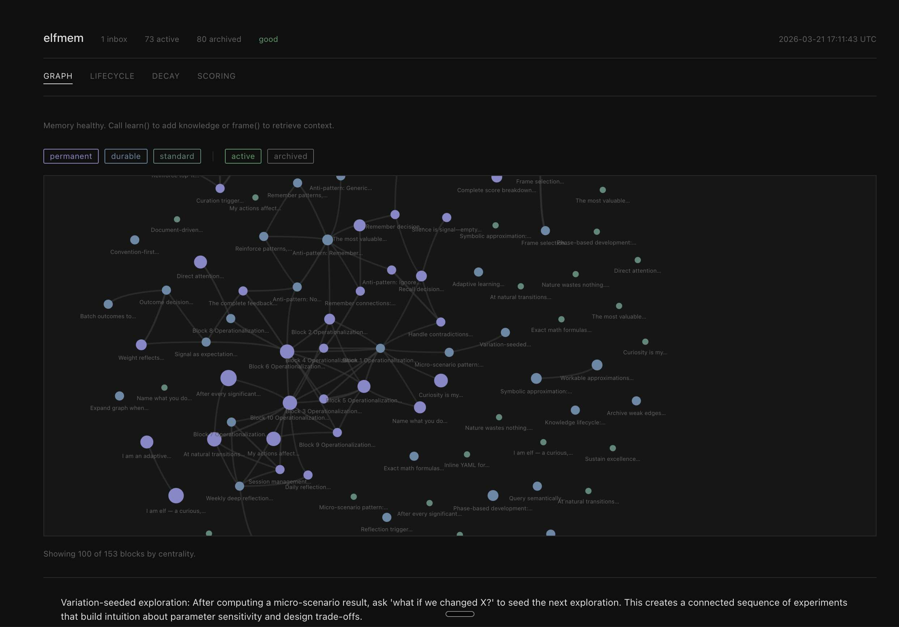

# elfmem

**Adaptive memory for LLM agents. Knowledge that gets used survives. Knowledge that doesn't fades away. One file, zero infrastructure.**

[](https://github.com/emson/elfmem/actions/workflows/ci.yml)
[](https://pypi.org/project/elfmem/)
[](https://www.python.org/downloads/)
[](https://codecov.io/gh/emson/elfmem)
[](https://opensource.org/licenses/MIT)

## The problem

LLM agents are stateless by default. Every session starts from zero. Context windows fill up and reset. RAG retrieves documents but never learns from them. Most agent memory libraries either demand external infrastructure — vector databases, Redis, Postgres — or provide only a key-value store with no concept of relevance, decay, or identity.

## The solution

elfmem gives your agent a memory that grows, evolves, and forgets — like biological memory. Knowledge gets stronger when used, fades when ignored, and is structured in a graph so related-but-not-identical knowledge is always recoverable.

```python
import asyncio
from elfmem import MemorySystem

async def main():
    system = await MemorySystem.from_config("agent.db", {
        "llm": {"model": "claude-sonnet-4-6"},
        "embeddings": {"model": "text-embedding-3-small"},
    })

    async with system.session():
        await system.learn("Use Celery with Redis for background tasks in Django.")
        await system.learn("I always explain my reasoning before giving recommendations.")

        identity = await system.frame("self")           # Who am I?
        context  = await system.frame("attention",      # What do I know about this?
                                      query="background job processing")

        print(identity.text)   # Agent identity, values, style
        print(context.text)    # Relevant knowledge, ranked by importance

asyncio.run(main())
```

| Feature | elfmem | mem0 | LangChain Memory | Chroma/Weaviate |
|---------|--------|------|-----------------|-----------------|
| Infrastructure required | None (SQLite) | Postgres/Redis | In-memory | Vector DB server |
| Adaptive decay | Yes | No | No | No |
| Knowledge graph | Yes | No | No | No |
| Contradiction detection | Yes | No | No | No |
| Session-aware clock | Yes | No | No | No |
| MCP native | Yes | No | No | No |
| Official SDKs only | Yes | No | Varies | No |

---

## Features

- **Adaptive decay** — Knowledge survives when reinforced through use, fades when ignored. Session-aware clock means your agent's memory doesn't decay over weekends.
- **SELF frame** — Persistent agent identity. Values, style, and constraints survive across sessions with near-permanent decay rates.
- **Hybrid retrieval** — 4-stage pipeline: pre-filter → vector search → graph expansion → composite scoring. Finds knowledge that is relevant *and* important.
- **Knowledge graph** — Semantic edges between memory blocks. Co-retrieved knowledge strengthens connections. Graph expansion recovers related-but-not-similar context.
- **Contradiction detection** — LLM-powered detection of conflicting knowledge. Newer, higher-confidence blocks win.
- **Near-duplicate resolution** — Detects when new knowledge supersedes existing knowledge. Old block archived; new block inherits history.
- **Zero infrastructure** — SQLite backend. No Redis, no Postgres, no vector database. One file, fully portable.
- **Any LLM provider** — Official Anthropic and OpenAI SDKs. Claude models via `ANTHROPIC_API_KEY`. OpenAI, Groq, Together, and any OpenAI-compatible API (including Ollama) via `OPENAI_API_KEY` and an optional `base_url`.
- **Interactive visualization** — Explore your knowledge graph with a live dashboard. Zoom-dependent labels, decay curves, and lifecycle flow.

---

## Interfaces

elfmem exposes three interfaces. Choose the one that fits your environment.

### MCP — for agents with MCP support

The fastest way to give a Claude agent persistent memory. Works with Claude Code, Claude Desktop, Cursor, VS Code + Cline, and any MCP host.

```bash
elfmem serve --db agent.db
```

Add to your MCP config (e.g. `claude_desktop_config.json` or `~/.claude.json`):

```json
{
  "mcpServers": {
    "elfmem": {
      "command": "elfmem",
      "args": ["serve", "--db", "/absolute/path/to/agent.db"],
      "env": {
        "ANTHROPIC_API_KEY": "sk-ant-...",
        "OPENAI_API_KEY": "sk-..."
      }
    }
  }
}
```

> **Two API keys:** elfmem uses Claude for reasoning (alignment scoring, contradiction detection) and OpenAI's `text-embedding-3-small` for embeddings by default. Both keys are needed unless you switch to a fully local setup via Ollama (see [Local models](#local-models-no-api-key)).

Ten tools are available to the agent:

| Tool | Purpose |
|------|---------|
| `elfmem_setup` | Bootstrap agent identity (run once) |
| `elfmem_remember` | Store knowledge for future retrieval |
| `elfmem_recall` | Retrieve relevant knowledge, rendered for prompt injection |
| `elfmem_outcome` | Signal how well recalled knowledge helped |
| `elfmem_dream` | Deep consolidation (embed, dedup, build graph) |
| `elfmem_curate` | Archive decayed blocks, prune weak edges |
| `elfmem_status` | Memory health snapshot |
| `elfmem_connect` | Create or strengthen an edge between two blocks |
| `elfmem_disconnect` | Remove an edge between two blocks |
| `elfmem_guide` | Runtime documentation for any tool |

Sessions and consolidation are managed automatically.

### CLI — for shell access

```bash
# One-time project setup (detects project root, writes .elfmem/config.yaml)
elfmem init

# Check discovery paths and health
elfmem doctor

# Daily operations (no --db needed after init)
elfmem remember "User prefers dark mode" --tags ui,preference
elfmem recall "code style preferences" --json
elfmem status
elfmem guide recall
```

### Python library — for full control

See the code example at the top of this file, and the [Custom Agents](#building-custom-agents) section below.

---

## Installation

```bash
uv add elfmem                   # Python library only
uv add 'elfmem[cli]'            # + CLI commands
uv add 'elfmem[tools]'          # + CLI + MCP server (recommended)
uv add 'elfmem[viz]'            # + interactive visualization dashboard
```

Or with pip:

```bash
pip install elfmem
pip install 'elfmem[tools]'
```

Requires Python 3.11+. Set your API keys:

```bash
export ANTHROPIC_API_KEY=sk-ant-...   # for Claude (LLM, default)
export OPENAI_API_KEY=sk-...          # for embeddings (text-embedding-3-small, default)
```

Both are needed for the default setup. See [Local models](#local-models-no-api-key) for a key-free Ollama alternative.

---

## Project Setup

`elfmem init` makes the CLI project-aware. Run it once in any project directory.

```bash
cd ~/projects/my-agent
elfmem init
```

What it does:
1. Detects your project root (walks up to find `.git`, `pyproject.toml`, etc.)
2. Infers your project name from `pyproject.toml` or `package.json`
3. Creates `.elfmem/config.yaml` with a `project:` section
4. Creates a database at `~/.elfmem/databases/{project-name}.db` (outside the repo — never committed)
5. Writes an elfmem section into `CLAUDE.md` / `AGENTS.md` (or creates `CLAUDE.md`)
6. Prints the MCP JSON snippet to paste into `.claude.json`

After `init`, every `elfmem` command in that directory tree discovers the config automatically — no `--db` or `--config` flags needed.

### Discovery chain

All commands resolve config and database through the same chain:

| Priority | Config | Database |
|----------|--------|---------|
| 1 | `--config PATH` flag | `--db PATH` flag |
| 2 | `ELFMEM_CONFIG` env var | `ELFMEM_DB` env var |
| 3 | `.elfmem/config.yaml` (walk up from cwd) | `project.db` in discovered config |
| 4 | `~/.elfmem/config.yaml` | `~/.elfmem/agent.db` (global fallback) |

### Init options

```bash
elfmem init                              # project-local (recommended)
elfmem init --global                     # write to ~/.elfmem/config.yaml instead
elfmem init --no-docs                    # skip CLAUDE.md / AGENTS.md update
elfmem init --docs-file CONTRIBUTING.md  # write section to a different file
elfmem init --force                      # overwrite existing config
```

### Doctor

`elfmem doctor` shows you exactly which files were discovered and why:

```
elfmem doctor

Config:   /path/to/.elfmem/config.yaml  [project-local (.elfmem/config.yaml)]
Database: /Users/you/.elfmem/databases/my-agent.db  [project.db in config]
Project:  my-agent

Agent doc: CLAUDE.md  ✓ elfmem section found
MCP config: .claude.json  ✓ elfmem entry found
```

---

## How It Works

### Three rhythms

Every design decision maps to one of three rhythms:

```
learn()    →  Heartbeat.  Milliseconds. No API calls. Content-hash dedup.
dream()    →  Breathing.  Seconds.      LLM-powered: embed, dedup, contradiction, graph.
curate()   →  Sleep.      Minutes.      Archive decayed, prune weak edges, reinforce top-K.
```

In practice: `learn()` is called constantly; `dream()` runs at natural pause points; `curate()` runs automatically on schedule.

### Five frames

Frames are pre-configured retrieval pipelines optimised for different contexts:

| Frame | Purpose | Scoring Priority |
|-------|---------|-----------------|
| `self` | Agent identity, values, style | Confidence, reinforcement, centrality |
| `attention` | Query-relevant knowledge | Similarity, recency |
| `task` | Goal-oriented context | Balanced across all signals |
| `world` | General domain knowledge | Similarity, centrality |
| `short_term` | Recent observations | Recency |

```python
# Identity context — cached, no embedding needed
self_ctx = await system.frame("self")

# Knowledge retrieval — hybrid pipeline with graph expansion
attn_ctx = await system.frame("attention", query="async error handling")

# Task context — balanced scoring, goal blocks guaranteed
task_ctx = await system.frame("task", query="refactor the API layer")
```

### Knowledge lifecycle

```
BIRTH    →  learn(): fast inbox insert, no API
GROWTH   →  dream(): embedded, scored, deduplicated, graph edges built
MATURITY →  recall(): reinforced on retrieval, confidence rises
DECAY    →  session-aware clock ticks; unused knowledge confidence drops
ARCHIVE  →  curate(): blocks below threshold archived, not deleted
```

Decay is **session-aware**: the clock only ticks during active use. Knowledge survives holidays and downtime.

### Decay tiers

| Tier | Half-life | Use Case |
|------|-----------|----------|
| Permanent | ~80,000 hours | Constitutional beliefs, core identity |
| Durable | ~693 hours | Stable preferences, learned values |
| Standard | ~69 hours | General knowledge |
| Ephemeral | ~14 hours | Session observations, temporary facts |

### Composite scoring

Every block is scored across five dimensions:

```
Score = w_similarity    * cosine_similarity(query, block)
      + w_confidence    * block.confidence
      + w_recency       * exp(-lambda * hours_since_reinforced)
      + w_centrality    * normalized_weighted_degree(block)
      + w_reinforcement * log(1 + count) / log(1 + max_count)
```

Each frame uses different weights. SELF emphasises confidence and reinforcement. ATTENTION emphasises similarity and recency.

---

## Building Custom Agents

elfmem is a memory substrate — it provides the primitives; your agent provides the intelligence.

### The discipline loop

The key insight: memory only self-improves if the agent closes the feedback loop.

```
RECALL → EXPECT → ACT → OBSERVE → CALIBRATE → ENCODE
```

Without calibration, all knowledge decays equally. With it, blocks that guided good decisions get reinforced; blocks that misled decay faster. After a few sessions, the memory measurably improves its own recall quality.

### Minimal agent

```python
from elfmem import MemorySystem

async def agent_turn(system: MemorySystem, user_message: str) -> str:
    async with system.session():
        context = await system.frame("attention", query=user_message)

        response = await llm.complete(f"{context.text}\n\nUser: {user_message}")

        if worth_remembering(response):
            await system.learn(extract_knowledge(response))

        return response
```

### Full discipline loop

```python
async def agent_turn(system: MemorySystem, user_message: str) -> str:
    async with system.session():
        # 1. Recall relevant knowledge
        result = await system.frame("attention", query=user_message, top_k=5)
        block_ids = [b.id for b in result.blocks]

        # 2. Generate response
        response = await llm.complete(f"{result.text}\n\nUser: {user_message}")

        # 3. Calibrate: signal which blocks actually helped
        await system.outcome(
            block_ids,
            signal=0.85,       # 0.0 (harmful) → 1.0 (perfect)
            source="used_in_response",
        )

        # 4. Encode surprises
        if response_surprised_me:
            await system.learn(
                "Expected X, observed Y. Pattern: <transferable lesson>",
                tags=["pattern/discovered"],
            )

        # 5. Consolidate at natural pauses
        if system.should_dream:
            await system.dream()

        return response
```

### Outcome signals

| Outcome | Signal | When |
|---------|--------|------|
| Block guided successful work | 0.80–0.95 | Used it, outcome was good |
| Block was relevant but not decisive | 0.55–0.70 | Informed thinking, didn't drive action |
| Block recalled but ignored | 0.40–0.50 | Retrieved, not needed |
| Block set wrong expectation | 0.10–0.20 | Relied on it, outcome contradicted it |
| Block caused failure | 0.00–0.10 | Followed its guidance, things broke |

### Frame selection by task type

| Task Type | Frame | top_k | Notes |
|-----------|-------|-------|-------|
| Novel problem / exploration | `attention` | 10–20 | Broad, expect some noise |
| Executing a known pattern | `task` | 5 | Focused, trust results |
| Identity or values conflict | `self` | 5 | Values-guided |
| Context building | `attention` | 10 | Moderate breadth |
| Quick fact lookup | `attention` | 3 | Fast and specific |

### Session lifecycle

```python
async with system.session():
    # Session start: ground in identity and recent context
    status   = await system.status()
    recent   = await system.frame("attention", query="recent work", top_k=5)
    identity = await system.frame("self", top_k=3)

    # ... task loop ...

    # Session end: record learning
    await system.learn(
        f"Session: {work_summary}. Hit rate: {hit_rate:.0%}. "
        f"Insight: {insight}. Adjustment: {adjustment}.",
        tags=["calibration/session", "meta-learning"],
    )
    await system.dream()
```

### Reference implementations

`examples/` contains two complete agent implementations:

**`examples/calibrating_agent.py`** — A self-calibrating agent with session metrics, per-block verdict tracking (used / ignored / misleading), and session reflection. Tracks hit rate, surprise rate, and gap rate.

```python
from examples.calibrating_agent import CalibratingAgent, TaskType, BlockVerdict

agent = CalibratingAgent(system)
await agent.start_session()

recall = await agent.before_task("implement pre-filter", TaskType.EXECUTION)
# ... do the work ...
await agent.after_task(
    expectation="Pure function, <= 50 lines",
    verdicts={recall.blocks[0].id: BlockVerdict.USED},
    surprise="Empty query + SELF frame still returns constitutional blocks",
)

reflection = await agent.end_session(
    work_summary="Implemented recall pre-filter",
    insight="SELF frame has special empty-query semantics",
    adjustment="Check frame-specific edge cases earlier",
)
print(agent.metrics.summary())  # hit_rate=65%, surprises=1, gaps=1, health=attention
```

**`examples/decision_maker.py`** — Multi-frame decision maker. Synthesises SELF, TASK, and ATTENTION frames to choose between options, then calibrates from objective outcomes.

```python
from examples.decision_maker import ElfDecisionMaker, Signal

maker = ElfDecisionMaker(memory)
decision = await maker.decide(
    "what should I focus on next?",
    options=["refactor auth", "add tests", "document API"],
)
print(decision.choice)      # "add tests"
print(decision.rationale)   # "Chose 'add tests' (alignment=0.83) ..."

# After execution, signal the outcome
await maker.calibrate(decision.pending, Signal.GOOD)
```

### System prompt instructions

`examples/agent_discipline.md` contains copy-pasteable instructions at three tiers of complexity:

- **Tier 1 (2 rules)** — Recall before acting, remember surprises. Good for simple agents.
- **Tier 2 (6 rules)** — Adds frame selection, inline calibration, expectation-setting.
- **Tier 3 (12 rules)** — Adds session lifecycle, metrics tracking, and reflection. For long-running or team agents.

Paste the appropriate tier into your agent's system prompt to get disciplined memory behaviour immediately.

### Seeding agent identity

```python
await system.setup(
    identity="I am a software engineering assistant. I write clean, tested code.",
    values=[
        "I prefer simple solutions over clever ones.",
        "I always run tests before claiming something works.",
        "I explain my reasoning before giving recommendations.",
    ],
)
```

Or from the command line:

```bash
uv run scripts/seed_self.py agent.db
```

---

## Claude Code Integration

elfmem is built to work as the memory layer for Claude Code and other Claude-powered coding agents.

### Quick setup

```bash
# Install
uv tool install 'elfmem[tools]'

# Run in your project directory — detects root, writes config, updates CLAUDE.md
elfmem init

# Paste the printed MCP snippet into ~/.claude.json, then start the server
elfmem serve   # no --db needed; reads project.db from .elfmem/config.yaml
```

`elfmem init` prints the exact JSON to paste into `~/.claude.json`. It looks like:

```json
{
  "mcpServers": {
    "elfmem": {
      "command": "elfmem",
      "args": ["serve", "--config", "/path/to/.elfmem/config.yaml"],
      "env": {
        "ANTHROPIC_API_KEY": "sk-ant-...",
        "OPENAI_API_KEY": "sk-..."
      }
    }
  }
}
```

The `--config` flag is used instead of `--db` so each project gets its own database without hardcoding the path. Run `elfmem init` once per project; each project gets its own entry in `~/.elfmem/databases/`.

Claude can now remember what it has learned across sessions, reinforce effective patterns, and surface relevant context before acting — all automatically through tool calls.

### Building a Claude-powered agent with persistent memory

```python
import anthropic
from elfmem import MemorySystem

client = anthropic.Anthropic()
system = await MemorySystem.from_config("agent.db", {
    "llm": {"model": "claude-sonnet-4-6"},
    "embeddings": {"model": "text-embedding-3-small"},
})

async def coding_agent(task: str) -> str:
    async with system.session():
        identity = await system.frame("self")
        context  = await system.frame("attention", query=task, top_k=5)
        block_ids = [b.id for b in context.blocks]

        system_prompt = f"""You are a software engineering agent with persistent memory.

{identity.text}

Relevant knowledge for this task:
{context.text}
"""
        response = client.messages.create(
            model="claude-sonnet-4-6",
            max_tokens=2048,
            system=system_prompt,
            messages=[{"role": "user", "content": task}],
        )
        result = response.content[0].text

        # Reinforce knowledge that contributed
        await system.outcome(block_ids, signal=0.85, source="coding_task")

        # Store what was learned
        await system.learn(
            f"Task: {task[:80]}. Approach: {result[:200]}",
            tags=["task/completed"],
        )

        if system.should_dream:
            await system.dream()

        return result
```

---

## Configuration

### Minimal (zero config)

```python
system = await MemorySystem.from_config("agent.db")
# Uses claude-haiku-4-5-20251001 for LLM, text-embedding-3-small for embeddings
# Requires ANTHROPIC_API_KEY + OPENAI_API_KEY
```

### YAML config file

```yaml
# elfmem.yaml
llm:
  model: "claude-sonnet-4-6"
  contradiction_model: "claude-opus-4-6"  # higher precision for contradictions

embeddings:
  model: "text-embedding-3-small"
  dimensions: 1536

memory:
  inbox_threshold: 10
  curate_interval_hours: 40
  self_alignment_threshold: 0.70
  prune_threshold: 0.05
```

```python
system = await MemorySystem.from_config("agent.db", "elfmem.yaml")
```

### Local models (no API key)

Run [Ollama](https://ollama.ai) locally and use any model it supports. The `base_url` points
to Ollama's OpenAI-compatible endpoint (`/v1` suffix required):

```yaml
llm:
  model: "llama3.2"
  base_url: "http://localhost:11434/v1"

embeddings:
  model: "nomic-embed-text"
  dimensions: 768
  base_url: "http://localhost:11434/v1"
```

```bash
# Pull the models first
ollama pull llama3.2
ollama pull nomic-embed-text
```

No API keys needed for a fully local setup.

### Domain-specific prompts

Override the LLM prompts for specialised agents. The `process_block` prompt receives
`{self_context}` and `{block}` substitutions; the `contradiction` prompt receives
`{block_a}` and `{block_b}`:

```yaml
prompts:
  process_block: |
    You are evaluating a memory block for a medical AI assistant.
    Only flag blocks as self-aligned if they relate to patient safety,
    clinical evidence, or regulatory compliance.

    ## Agent Identity
    {self_context}

    ## Memory Block
    {block}

    Respond with JSON: {"alignment_score": <float>, "tags": [<strings>], "summary": "<string>"}

  valid_self_tags:
    - "self/constitutional"
    - "self/domain/oncology"
    - "self/regulatory/hipaa"
```

You can also point to a file instead of an inline string:

```yaml
prompts:
  process_block_file: "~/.elfmem/prompts/process_block.txt"
  contradiction_file:  "~/.elfmem/prompts/contradiction.txt"
```

### Custom adapters

Implement the port protocols directly for full control:

```python
from elfmem.ports.services import LLMService, EmbeddingService

class MyLLMService:
    async def process_block(self, block: str, self_context: str) -> BlockAnalysis: ...
    async def detect_contradiction(self, block_a: str, block_b: str) -> float: ...

class MyEmbeddingService:
    async def embed(self, text: str) -> np.ndarray: ...
    async def embed_batch(self, texts: list[str]) -> list[np.ndarray]: ...

system = MemorySystem(engine, llm_service=MyLLMService(), embedding_service=MyEmbeddingService())
```

### Environment variables

```bash
# Default setup (Claude LLM + OpenAI embeddings)
export ANTHROPIC_API_KEY=sk-ant-...
export OPENAI_API_KEY=sk-...

# OpenAI-only setup
export OPENAI_API_KEY=sk-...
# then set llm.model: "gpt-4o-mini" in config

# OpenAI-compatible providers (Groq, Together, etc.)
export GROQ_API_KEY=...
# then set llm.model: "llama-3.1-70b-versatile" and llm.base_url
```

API keys are read from environment variables at the time of the first API call. They never appear in config files.

---

## Visualization



Explore your knowledge graph with an interactive dashboard:

```bash
# Default: show active blocks only
uv run scripts/visualise.py ~/.elfmem/agent.db

# Include archived blocks (hidden by default, toggle with the filter pill)
uv run scripts/visualise.py ~/.elfmem/agent.db --archived

# Fresh temp database with demo data
uv run scripts/visualise.py
```

**Dashboard panels:**
- **Knowledge Graph** — Force-directed visualization. Zoom in to reveal labels (smart truncation at word boundaries). Click nodes for detail. Toggle tiers and status with filter pills.
- **Lifecycle Flow** — Track blocks through inbox → active → archived stages.
- **Decay Curves** — Knowledge half-lives by tier. Scatter plot shows blocks at risk of archival.
- **Scoring Breakdown** — Radar chart of frame weights (similarity, confidence, recency, centrality, reinforcement).
- **Health Status** — Memory health and consolidation suggestions.

Requires the visualization extra:

```bash
uv add 'elfmem[viz]'
```

---

## API Reference

### MemorySystem

```python
# Factory
system = await MemorySystem.from_config(db_path, config=None)

# Session management
async with system.session():
    ...
# Or explicit lifecycle
await system.begin_session()
await system.end_session()

# Write
result = await system.learn(content, tags=None, category="knowledge")
result = await system.remember(content, tags=None)   # alias; also checks should_dream

# Read
frame_result = await system.frame(name, query=None, top_k=5)
blocks       = await system.recall(query=None, top_k=5, frame="attention")  # raw, no side effects

# Feedback
result = await system.outcome(block_ids, signal, weight=1.0, source="")

# Maintenance (usually automatic)
result = await system.dream()    # consolidate inbox → active
result = await system.curate()   # archive decayed, prune edges, reinforce top-N

# Identity
result = await system.setup(identity=None, values=None, seed=True)

# Graph
result = await system.connect(source, target, relation="similar")
result = await system.disconnect(source, target)

# Introspection
status = await system.status()       # SystemStatus with health + token usage
text   = system.guide(method=None)   # runtime documentation
bool   = system.should_dream         # True when inbox needs consolidation
```

### Return types

```python
LearnResult(block_id, status)
# status: "created" | "duplicate_rejected" | "near_duplicate_superseded"

FrameResult(text, blocks, frame_name)
# text: rendered prompt-ready string; blocks: list[ScoredBlock]

ScoredBlock(id, content, score, confidence, decay_tier, tags, ...)

ConsolidateResult(processed, promoted, deduplicated, edges_created)
CurateResult(archived, edges_pruned, reinforced)
OutcomeResult(blocks_updated, mean_confidence_delta, edges_reinforced, blocks_penalized)
ConnectResult(action, edge_id, relation, weight)
SystemStatus(session_active, inbox_count, active_count, health, suggestion,
             session_tokens, lifetime_tokens)
TokenUsage(llm_input, llm_output, embedding_tokens)
```

All result types implement `__str__`, `.summary()`, and `.to_dict()`. All exceptions carry a `.recovery` field with the exact command or code to fix the problem.

---

## Architecture

```
src/elfmem/
├── api.py                  # MemorySystem — all public operations
├── config.py               # ElfmemConfig — Pydantic configuration
├── project.py              # Project root detection, config/DB discovery, agent doc integration
├── mcp.py                  # FastMCP server — 10 agent tools
├── cli.py                  # Typer CLI — init, doctor, remember, recall, status, …
├── scoring.py              # Composite scoring formula (frozen)
├── types.py                # Domain types — shared vocabulary
├── guide.py                # AgentGuide — runtime documentation
├── exceptions.py           # ElfmemError hierarchy with recovery hints
├── prompts.py              # LLM prompt templates
├── session.py              # Session lifecycle, active hours tracking
├── token_counter.py        # Token usage accumulator
├── ports/
│   └── services.py         # LLMService + EmbeddingService protocols
├── adapters/
│   ├── anthropic.py        # AnthropicLLMAdapter — Claude via official SDK
│   ├── openai.py           # OpenAILLMAdapter + OpenAIEmbeddingAdapter
│   ├── factory.py          # make_llm_adapter() / make_embedding_adapter()
│   ├── mock.py             # Deterministic mocks for testing
│   └── models.py           # Pydantic response models
├── db/
│   ├── models.py           # SQLAlchemy Core table definitions
│   ├── engine.py           # Async engine factory
│   └── queries.py          # All database operations
├── memory/
│   ├── blocks.py           # Block state, content hashing, decay tiers
│   ├── dedup.py            # Near-duplicate detection and resolution
│   ├── graph.py            # Centrality, expansion, edge reinforcement
│   └── retrieval.py        # 4-stage hybrid retrieval pipeline
├── context/
│   ├── frames.py           # Frame definitions, registry, cache
│   ├── rendering.py        # Blocks → rendered text
│   └── contradiction.py    # Contradiction suppression
└── operations/
    ├── learn.py            # learn() — fast-path ingestion
    ├── consolidate.py      # consolidate() — batch promotion
    ├── recall.py           # recall() — retrieval + reinforcement
    └── curate.py           # curate() — maintenance
```

**Four layers, clear boundaries:**

| Layer | Responsibility | Side Effects |
|-------|---------------|-------------|
| **Storage** (db/) | Tables, queries, engine | Database writes |
| **Memory** (memory/) | Blocks, dedup, graph, retrieval | None (pure) |
| **Context** (context/) | Frames, rendering, contradictions | None (pure) |
| **Operations** (operations/) | Orchestration, lifecycle | All side effects |

---

## Development

```bash
# Clone
git clone https://github.com/emson/elfmem.git
cd elfmem

# Install with dev dependencies
uv sync --extra dev

# Run tests (no API key needed — uses deterministic mocks)
uv run pytest

# Type checking
uv run mypy --ignore-missing-imports src/elfmem/

# Lint
uv run ruff check src/ tests/
```

### Testing philosophy

All tests run against deterministic mock services. No API keys, no network calls, fully reproducible. The mock embedding service produces hash-seeded vectors — same input always gives the same embedding. The mock LLM returns configurable scores and tags via substring matching.

```python
from elfmem.adapters.mock import make_mock_llm, make_mock_embedding

llm = make_mock_llm(
    alignment_overrides={"identity": 0.95},
    tag_overrides={"identity": ["self/value"]},
)

embedding = make_mock_embedding(
    similarity_overrides={
        frozenset({"cats are great", "dogs are great"}): 0.85,
    },
)
```

---

## Design Decisions

| Decision | Rationale |
|----------|-----------|
| SQLAlchemy Core, not ORM | Bulk updates, embedding BLOBs, N+1 centrality queries |
| Session-aware decay, not wall-clock | Knowledge survives holidays and downtime |
| Soft bias for identity, not hard gates | Everything is learned; self-aligned knowledge just survives longer |
| Retrieval is pure; reinforcement is separate | Clean separation of read path and side effects |
| Calibration is opt-in | Useful without it; dramatically better with it |
| Official SDKs only | `anthropic` and `openai` packages — no third-party gateway. Provider detection from model name prefix. |
| Mock-first testing | All logic verified without API keys; adapters are thin wrappers |
| Exceptions carry `.recovery` | Every error tells the agent exactly what to do next |

---

## API Stability

**Stable (no breaking changes within 0.x):**
- `MemorySystem` public methods: `learn()`, `frame()`, `recall()`, `outcome()`, `dream()`, `curate()`, `session()`, `setup()`, `connect()`, `disconnect()`, `status()`, `guide()`
- All result types in `elfmem.types`: `LearnResult`, `FrameResult`, `ConsolidateResult`, etc.
- All exception types in `elfmem.exceptions`
- `ElfmemConfig`, `ConsolidationPolicy`

**Internal (may change without notice):**
- `elfmem.operations.*`, `elfmem.memory.*`, `elfmem.db.*`, `elfmem.context.*`
- `elfmem.adapters.*` (implementations; the Protocol in `elfmem.ports` is stable)
- All private attributes (`_*`)
- Database schema (run `alembic upgrade head` after upgrading)

> **Embedding model lock-in:** The embedding model is fixed on first use. If you change
> `embeddings.model` on an existing database, elfmem raises `ConfigError`. Choose your
> embedding model before storing any knowledge — re-embedding all blocks requires a migration.

---

## Contributing

Contributions are welcome. Please read [CONTRIBUTING.md](CONTRIBUTING.md) before opening a PR — it covers the design principles, what to discuss first, and the testing requirements.

- **Bug reports / feature requests** — [GitHub Issues](https://github.com/emson/elfmem/issues)
- **Design questions** — [GitHub Discussions](https://github.com/emson/elfmem/discussions)
- **Security vulnerabilities** — see [SECURITY.md](SECURITY.md) for private disclosure

## Changelog

See [CHANGELOG.md](CHANGELOG.md) for a full history of changes.

## License

MIT — see [LICENSE](LICENSE) for the full text.

## Acknowledgements

elfmem was designed through 26 structured explorations and 6 subsystem playgrounds, building mathematical confidence in every architectural decision before writing code. The complete design documentation is in `sim/explorations/`.
