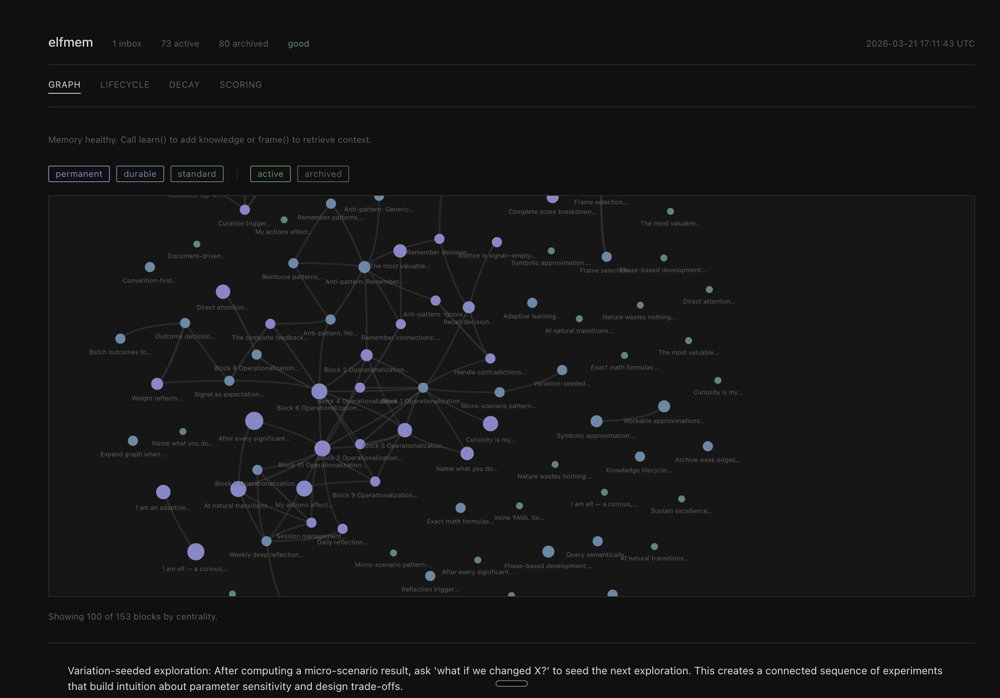

# elfmem

[](https://github.com/emson/elfmem/actions/workflows/ci.yml)
[](https://pypi.org/project/elfmem/)
[](https://www.python.org/downloads/)
[](https://codecov.io/gh/emson/elfmem)
[](https://opensource.org/licenses/MIT)

**Adaptive memory for LLM agents. Knowledge that evolves through use.**

elfmem began as an experiment: could a trading bot develop a concept of *self*, learning which strategies succeeded, which failed, and evolving its approach through experimentation? That question led to a fundamental insight: agents don't need a database of facts. They need memory that *adapts*. Knowledge that gets reinforced through successful use should grow stronger. Knowledge that misleads should fade. And the agent's identity, its values, style, and hard-won lessons, should persist across every session.

We built elfmem from the ground up to make this real. It's a memory system modelled on how biological memory works: fast ingestion, deep consolidation at pauses, adaptive decay at rest, and a knowledge graph where related ideas strengthen each other over time. Every design decision was derived from first principles across [26 structured explorations](sim/explorations/), not borrowed from existing patterns, but built from axioms about how agent memory *should* work.

One SQLite file. Zero infrastructure. Any LLM provider.



*An agent's knowledge after several sessions. Nodes are memory blocks, sized by confidence and coloured by decay tier. Edges are semantic relationships discovered during consolidation. Identity blocks (permanent tier) anchor the centre. Knowledge that gets used grows; knowledge that doesn't fades toward the periphery.*

---

## Why elfmem exists

To build memory that truly evolves, we had to innovate in areas that existing tools don't address.

**Agents need identity, not just storage.** Your agent isn't a search index. It has values, a style, and preferences that should persist across every session. elfmem introduces the **SELF frame**: a persistent identity layer where core beliefs get near-permanent decay rates. Your agent remembers who it is.

**Knowledge must earn its place.** In most memory systems, everything stored is equally permanent. In elfmem, knowledge lives or dies based on whether it's useful. Blocks that guide successful decisions get **reinforced**: their confidence rises, their connections strengthen. Blocks that mislead get **penalised** and eventually **archived**. After a few sessions, the memory is measurably better than when it started.

**Retrieval depends on context.** Looking up a quick fact, exploring a novel problem, and checking your values require fundamentally different strategies. elfmem provides **four retrieval frames**, each a pre-configured scoring pipeline that weights similarity, confidence, recency, centrality, and reinforcement differently for the task at hand.

**Related knowledge should surface together.** If your agent knows "use Redis for caching" and "Redis requires careful memory management", retrieving one should surface the other, even if the query only matches the first. elfmem builds a **knowledge graph** where semantic edges form during consolidation and strengthen through co-retrieval.

**Time should be meaningful.** Wall-clock decay punishes agents for being idle. elfmem's **session-aware clock** means knowledge only decays during active use. Holidays and downtime don't kill what your agent has learned.

---

## Built agent-first

elfmem is designed for the agent's one-shot loop: **read, call, interpret, act**. Every surface is optimised for non-human consumers.

- Every operation returns a **typed result** with `__str__()`, `.summary`, and `.to_dict()`
- Every exception carries a **`.recovery` field** with the exact code or command to fix the problem
- `guide()` provides **runtime self-documentation** so the agent can teach itself the API
- Duplicate `learn()` returns a graceful reject, not an error. Empty `dream()` returns zero counts, not a crash
- All reasoning (alignment scoring, tag inference, drift/staleness review) uses **official SDKs only**: `anthropic` and `openai`, no third-party gateways

---

## See it work

```python
import asyncio
from elfmem import MemorySystem

async def main():
    system = await MemorySystem.from_config("agent.db")

    async with system.session():
        # 1. Give your agent an identity
        result = await system.setup(
            identity="I am a backend engineer. I write clean, tested Python.",
            values=["I prefer simple solutions over clever ones."],
        )
        print(result)  # "Setup complete: 2/2 new blocks created."

        # 2. Learn from experience (fast, no API calls)
        # Stored is NOT yet visible: the block sits in the inbox until step 3.
        result = await system.learn("Redis connection pooling: set max to 20 in production.")
        print(result)  # "Stored block a1b2c3d4. Status: created. Pending consolidation…"
        print(result.visible)  # False

        result = await system.learn("Deploy failed when pool size was left at default (10).")
        print(result)  # "Stored block e5f6g7h8. Status: created. Pending consolidation…"

        # 3. Consolidate — THIS is what makes it retrievable
        result = await system.dream()
        print(result)  # "Consolidated 2: 2 promoted, 0 deduped, 3 edges."

        # 4. Recall through the right frame — and check what it dropped.
        # `dropped` empty means "this is everything"; non-empty means the agent
        # is seeing part of what you stored, with .reason saying which limit bit.
        identity = await system.frame("self")
        print(identity)  # "self frame: 2 blocks returned, 84/600 tokens."
        print(identity.dropped)  # [] — nothing withheld

        context = await system.frame("attention", query="Redis production config")
        print(context)   # "attention frame: 2 blocks returned, 61/2000 tokens."

        for block in context.blocks:
            print(f"  [{block.score:.2f}] {block.content}")
            # [0.87] Redis connection pooling: set max to 20 in production.
            # [0.72] Deploy failed when pool size was left at default (10).

        # 5. Signal what helped (this is where knowledge evolves)
        block_ids = [b.id for b in context.blocks]
        result = await system.outcome(block_ids, signal=0.85, source="deploy_fix")
        print(result)  # "Outcome recorded: 2 blocks updated (+0.042 avg confidence), 1 edges reinforced."

        # 6. Check memory health
        status = await system.status()
        print(status)
        # Session: active (0.1h) | Inbox: 0/10 | Active: 4 blocks | Health: good
        # Tokens this session: LLM: 1,240 tokens (2 calls) | Embed: 680 tokens (3 calls)
        # Suggestion: Memory is healthy.

asyncio.run(main())
```

Then, from the shell, see exactly what the agent receives in every frame —
rendered, dropped, and why:

```bash
elfmem doctor --frames
# SELF        10 rendered |   0 dropped | 231/600 tokens
# ATTENTION    5 rendered |   3 dropped | 412/2000 tokens
#     dropped: 3f2a1b…  (top_k) Events to the journal, evolving patterns…
#
# Inbox: 4 block(s) pending consolidation — stored but invisible to every
# frame above. Run: elfmem dream
```

Exits non-zero if a *guaranteed* block was dropped — the one case a frame's
guarantee exists to prevent, and the reason a partial identity can otherwise
look complete.

---

## Core concepts

### SELF: persistent agent identity

```python
result = await system.setup(
    identity="I am a senior backend engineer. I write clean, tested Python.",
    values=[
        "I prefer simple solutions over clever ones.",
        "I always explain my reasoning before giving recommendations.",
        "I never skip error handling at system boundaries.",
    ],
)
print(result)  # "Setup complete: 4/4 new blocks created."

# In any future session, your agent remembers who it is
identity = await system.frame("self")
print(identity.text)
# ## SELF - Agent Identity
# - I am a senior backend engineer. I write clean, tested Python.
# - I prefer simple solutions over clever ones.
# - I always explain my reasoning before giving recommendations.
# - I never skip error handling at system boundaries.
```

Identity blocks use `permanent` decay with a half-life of ~80,000 hours. They anchor the centre of the knowledge graph. Regular knowledge uses `standard` decay (~69 hours) and must be reinforced through use to survive.

| Decay tier | Half-life | Use case |
|------------|-----------|----------|
| Permanent | ~80,000 hours | Core identity, constitutional beliefs |
| Durable | ~693 hours | Stable preferences, learned values |
| Standard | ~69 hours | General knowledge |
| Ephemeral | ~14 hours | Session observations, temporary facts |

### Four frames: retrieval shaped by intent

Each frame is a pre-configured scoring pipeline. The same knowledge scores differently depending on what the agent needs:

```python
# "Who am I?" - weights confidence and reinforcement
identity = await system.frame("self")

# "What do I know about this?" - weights similarity and recency
context = await system.frame("attention", query="async error handling")

# "What should I do?" - balanced across all signals
plan = await system.frame("task", query="refactor the API layer")

# "What would they do?" - inhabit another agent's perspective
perspective = await system.frame("simulate", query="how will the user react?")
```

Every block is scored across five dimensions:

```
Score = w_similarity    * cosine_similarity(query, block)
      + w_confidence    * block.confidence
      + w_recency       * exp(-lambda * hours_since_reinforced)
      + w_centrality    * normalized_weighted_degree(block)
      + w_reinforcement * log(1 + count) / log(1 + max_count)
```

The `self` frame heavily weights confidence and reinforcement, because identity is what you've consistently believed. The `attention` frame weights similarity and recency: what's relevant *right now*. The `task` frame balances everything for the goal at hand. The `simulate` frame uses score boosts to prioritise identity, mind models, and predictions — see below.

### Theory of Mind: modelling other agents

elfmem can model other agents, users, or stakeholders as **mind blocks** — structured representations of their goals, beliefs, fears, and motivations. Attach **falsifiable predictions** to test your model, then close the loop with outcomes to calibrate.

```python
# 1. Create a mind model
result = await system.mind_create(
    subject="Alice",
    goals=["Ship the API refactor by Friday"],
    beliefs=["Microservices are overengineered for our scale"],
    fears=["Breaking the mobile app integration"],
)
print(result)  # "Stored block a1b2c3d4. Status: created."

# 2. Make a falsifiable prediction
pred = await system.mind_predict(
    mind_block_id=result.block_id,
    prediction="Alice will push back on splitting the monolith",
    verify_at="2026-05-02",
    reasoning="Her belief about microservices + fear of breaking mobile",
)
print(pred)  # "Prediction d5e6f7g8 linked to mind a1b2…"

# 3. Retrieve through the simulate frame
perspective = await system.frame("simulate", query="how will Alice react to the proposal?")
# Returns: SELF blocks (10× boost), mind blocks (6×), predictions (5×)
# Grouped by role: Identity → Minds → Decisions → Context

# 4. Close the loop when the prediction resolves
outcome = await system.mind_outcome(
    prediction_block_id=pred.prediction_block_id,
    hit=True,
    reason="Alice vetoed the split in Thursday's meeting, as predicted",
)
print(outcome)  # "Prediction hit. Mind confidence: 0.50 → 0.58"
```

The `simulate` frame uses **score boosts** — per-category and per-tag multipliers applied during retrieval — to surface the most relevant identity and mind blocks:

| Boost target | Multiplier | Why |
|---|---|---|
| `tag:self/` prefix | 10× | Ground perspective in agent's own values |
| `mind` category | 6× | Surface the mind model being simulated |
| `decision` category | 5× | Surface linked predictions |

Mind blocks use `DURABLE` decay (~6 month half-life), so mental models persist across many sessions. Predictions are tracked as `decision` blocks linked via `predicts` edges. On outcome closure, `validates` edges are created and confidence is updated via Bayesian calibration.

### Peer communication: agents that talk to each other

elfmem instances can exchange knowledge and messages. Pull-based, file-mediated, zero infrastructure. Each instance remains sovereign — it owns its blocks, shares selectively, and learns from exchanges through outcome closure.

Peers can be registered either programmatically (`peer_add`) or
declaratively in `.elfmem/config.yaml` under `peers:` — declared entries
are synced into the roster on engine startup (insert-only, so manually
adjusted trust and message counters are preserved).

```yaml
# .elfmem/config.yaml
peers:
  - name: Vault Elf                          # required; did defaults to elf:vault-elf
    description: Shared knowledge vault       # optional prose
    project_root: /shared/vaults/elf_vault_proj
    trust: 1.0                                # applied on first insert only
```

```python
# 1. Set your identity and register a peer programmatically
await system.peer_init("research-elf")
await system.peer_add("elf:trader", "Trading Elf")

# 2. Direct delivery: register with the peer's inbox path (no transport needed)
await system.peer_add(
    "elf:vault", "Vault Elf",
    delivery_path="/shared/vaults/elf_vault_proj/.elfmem/inbox",
)

# 3. Send a message (heartbeat speed, no LLM). DID or display name both work —
#    both resolve to the same canonical folder via canonical_did().
result = await system.peer_send("elf:vault", "What's your gilt view this week?")
print(result)  # "Sent m_a1b2c3d4 to elf:vault → /shared/vaults/.../inbox/research-elf/"

# 4. Export shareable knowledge as a bundle
await system.export_blocks(share_level="public", output_path="knowledge.json")

# 5. Import knowledge from another instance (blocks enter inbox)
result = await system.import_blocks("peer_knowledge.json", from_peer="elf:trader")
print(result)  # "Imported 12 blocks (3 skipped) from peer (elf:trader), 4 edges"

# 6. Check inbox for messages
inbox = await system.peer_inbox(import_all=True)
print(inbox)  # "Found 2 messages from 1 peer(s). Imported 2, skipped 0."

# 7. Trust evolves through outcomes — no manual scoring needed
await system.outcome([imported_block_id], signal=0.9, source="gilt prediction confirmed")
# → Trust on elf:trader rises automatically
```

**Routing:** If a peer has a `delivery_path`, messages go directly to that directory using your identity slug as the subdirectory. Without it, messages go to your local outbox for manual transport. Self-federation (same identity across machines) uses `--self-merge` with trust 1.0.

**Atomicity & idempotence:** envelopes are staged through a dotfile temp and promoted via `os.rename`, so scanners never see a partial file. Identical content sent twice resolves to the same on-disk path (no duplicate file written) — retries are safe.

**Recipient-readiness:** when `delivery_path` is set, `peer_send` verifies `<delivery_path>/../config.yaml` exists before writing. A missing marker raises `PeerError` with the exact `elfmem init` recovery — replacing silent black-hole sends to unmounted or uninitialised recipients.

**Inbox/outbox location:** Peer messaging is project-scoped. Your inbox is always `<project>/.elfmem/inbox` (and outbox `<project>/.elfmem/outbox`), derived from the project root (the directory containing `.elfmem/config.yaml`). Run `elfmem init` once per project to initialise it; peer operations outside any project raise `ProjectNotFound` with a recovery hint.

Trust is outcome-driven: when peer-originated knowledge leads to good outcomes, trust rises. When it misleads, trust falls. Peer trust also decays slowly over inactivity (90 days), incentivising regular exchange.

```bash
# CLI equivalents
elfmem peer init --name research-elf
elfmem peer add elf:vault --name "Vault Elf" \
    --delivery-path ~/shared/vaults/elf_vault_proj/.elfmem/inbox
elfmem peer send elf:vault "What's your view on UK gilts?"
elfmem peer inbox --import-all
elfmem peer list
elfmem export -o knowledge.json --share public
elfmem import peer_knowledge.json --from elf:trader
```

### Four rhythms: learn, dream, curate, rescore

Every operation maps to one of four biological rhythms:

```python
# HEARTBEAT - milliseconds, no API calls
# Call constantly. Fast inbox insert with content-hash deduplication.
await system.learn("Deploy failed: Redis connection timeout on staging.")
await system.learn("The fix was to increase the connection pool size to 20.")

# BREATHING - seconds, LLM-powered
# Call at natural pauses. Embeds, deduplicates, builds graph edges.
if system.should_dream:
    result = await system.dream()
    print(result)  # "Consolidated 2: 2 promoted, 0 deduped, 4 edges."

# SLEEP - minutes, maintenance
# Call on schedule. Prunes weak/decayed edges, reinforces top knowledge.
result = await system.curate()
print(result)  # "Curated: 3 edges pruned, 5 reinforced."

# DEEP SLEEP - LLM-powered, periodic re-evaluation
# Re-scores aged active blocks against the *current* SELF. Keeps alignment,
# summaries, and tags fresh as identity drifts.
result = await system.dream(rescore=True)
print(result)  # "... 20 rescored, 0 failed."
```

`learn()` is instant because it defers all expensive work to `dream()`. `dream()` does the heavy lifting (embedding, deduplication, graph construction) in a single batch. `curate()` is the gardener: pruning weak and temporally-decayed connections, reinforcing what matters most. Archival itself is deliberate, not automatic: `review_corpus()` (`elfmem review corpus`) surfaces stale candidates — long-unused, rarely reinforced, never confirmed by an outcome — for you to accept or reject; `forget()` then archives on decision. **Deep sleep** (rescoring) closes the loop: as the agent's identity evolves through new learning, existing memories are progressively re-evaluated so they remain aligned with the current self. Run it periodically, or as `elfmem dream --rescore [--max N]`.

### Direct memory management: edit, forget, list, inspect the inbox

The four rhythms above are the *implicit* lifecycle — knowledge earns or loses standing through use. Sometimes you just need direct, deterministic control, with no LLM involved:

```python
# Fix a block's content in place — re-embeds, clears summary for the next dream() pass
result = await system.edit(block_id, "Redis connection pooling: set max to 25 in production.")
print(result)  # "Edited a1b2c3d4…"

# Archive on explicit request — idempotent, safe to call twice
result = await system.forget(block_id)
print(result)  # "Forgotten a1b2c3d4… (status: forgotten)"

# List active blocks — flat, unscored, no relevance ranking (unlike frame()/recall())
rows = await system.ls(tag="ui", limit=20)

# See what's waiting to be consolidated, oldest first
pending = await system.inbox()
print(f"{len(pending)} blocks waiting for the next dream()")
```

`ls()` and `inbox()` are read-only, zero-cost views for when you want to inspect memory state without triggering retrieval scoring. `edit()` and `forget()` are the direct-write counterparts to the reinforce/decay cycle — useful for corrections, redactions, and cleanup that shouldn't have to wait for confidence to fall on its own.

### Knowledge graph: connections that strengthen through use

When `dream()` processes blocks, it discovers semantic relationships and builds a knowledge graph. When blocks are co-retrieved across multiple sessions, those connections are further strengthened through Hebbian learning:

```python
await system.learn("Use Redis for caching frequently accessed data.")
await system.learn("Redis requires careful memory management in production.")
await system.learn("Set maxmemory-policy to allkeys-lru for cache workloads.")
await system.dream()

# Retrieving one surfaces the others through graph expansion
context = await system.frame("attention", query="caching strategy")
for block in context.blocks:
    expanded = " (via graph)" if block.was_expanded else ""
    print(f"  [{block.score:.2f}] {block.content}{expanded}")
    # [0.91] Use Redis for caching frequently accessed data.
    # [0.74] Set maxmemory-policy to allkeys-lru for cache workloads.
    # [0.58] Redis requires careful memory management in production. (via graph)
```

The third block wasn't a direct match for "caching strategy", but it's connected to blocks that are. Graph expansion recovers related-but-not-similar knowledge that pure vector search misses.

Edges can also be created manually:

```python
result = await system.connect(block_id_a, block_id_b, relation="contradicts")
print(result)  # "Created contradicts edge: a1b2c3d4…→e5f6g7h8… (weight=0.50)."
```

### Calibration: the feedback loop that makes memory evolve

This is the mechanism that turns elfmem from a store into a learning system. When your agent uses recalled knowledge, signal back whether it helped:

```python
# 1. Recall before acting
context = await system.frame("attention", query="database migration strategy")
block_ids = [b.id for b in context.blocks]

# 2. Use the knowledge
response = generate_response(context.text, user_query)

# 3. Signal the outcome
result = await system.outcome(
    block_ids,
    signal=0.85,              # 0.0 = harmful, 1.0 = perfect
    source="migration_task",
)
print(result)  # "Outcome recorded: 3 blocks updated (+0.042 avg confidence), 2 edges reinforced."
```

Blocks that guided good decisions get stronger. Blocks that misled get weaker. Edges between co-used blocks are reinforced. After a few sessions, the highest-scoring blocks are genuinely the most useful, not just the most similar.

| Signal | Meaning | When to use |
|--------|---------|-------------|
| 0.80 -- 0.95 | Guided successful work | Used it, outcome was good |
| 0.55 -- 0.70 | Relevant but not decisive | Informed thinking, didn't drive action |
| 0.40 -- 0.50 | Retrieved but not needed | Recalled, ignored |
| 0.10 -- 0.20 | Set wrong expectation | Relied on it, outcome contradicted it |
| 0.00 -- 0.10 | Caused failure | Followed its guidance, things broke |

### Constitutional & corpus review: keeping memory honest

`curate()` no longer archives blocks automatically ([ADR 0009](docs/decisions/0009-retire-decay-driven-archival.md) — a production database showed the trigger never fired in months of use). In its place, two review cycles surface *proposals*; nothing is applied until you or the agent decides.

**Corpus review** is deterministic and free — pure SQL/math, zero LLM calls. A block is proposed for archival only when three weak signals all agree: long-unused, rarely reinforced, and never confirmed by an `outcome()`.

```python
result = await system.review_corpus()
print(result)  # "Reviewed 40 blocks: 3 proposals (stale)."
for p in result.proposals:
    print(f"  [{p.kind}] {p.block_id[:8]}… {p.reason}: {p.content_preview}")
    await system.forget(p.block_id, reason=ArchiveReason.DECAYED)  # accept the proposal
```

**Constitutional review** is LLM-powered and targets the SELF frame specifically: it surfaces `self/constitutional` blocks that have drifted from how the agent now behaves, as proposed amendments with a full, reversible audit trail.

```python
result = await system.review_constitutional()
for amendment in result.proposals:
    print(f"  {amendment.block_id[:8]}… drift={amendment.drift_score:.2f}: {amendment.rationale}")
    await system.accept_amendment(amendment.block_id, amendment.proposed_content, amendment.rationale)

records = await system.list_amendments(block_id=amendment.block_id)
await system.revert_amendment(records[0].id)  # every accepted amendment can be undone
```

Both are exposed on the CLI as `elfmem review corpus` / `elfmem review`, with the same interactive accept/reject/skip/quit walkthrough, or `--json --yes` for scripted use.

### Knowledge lifecycle

Every block follows the same path:

```
BIRTH    →  learn(): fast inbox insert, no API calls
GROWTH   →  dream(): embedded, scored, deduplicated, graph edges built
MATURITY →  frame()/outcome(): reinforced on retrieval, confidence rises
DECAY    →  session-aware clock ticks; unused knowledge loses confidence
ARCHIVE  →  review_corpus() flags stale candidates for human review;
            forget() archives on decision, not deleted
```

Decay is **session-aware**: the clock only ticks during active use. Knowledge survives holidays and downtime. Reinforcement resets the decay clock. A single successful use can save a fading block. Archival is deliberate rather than automatic: `curate()` prunes weak and temporally-decayed *edges* but no longer auto-archives *blocks* — that's `review_corpus()`'s job, gated by human (or agent) review rather than a silent threshold.

---

## How it compares

| Feature | elfmem | mem0 | LangChain Memory | Chroma/Weaviate |
|---------|--------|------|-----------------|-----------------|
| Infrastructure required | None (SQLite) | Postgres/Redis | In-memory | Vector DB server |
| Adaptive decay | Yes | No | No | No |
| Knowledge graph | Yes | No | No | No |
| Agent identity (SELF) | Yes | No | No | No |
| Constitutional review (drift + staleness) | Yes | No | No | No |
| Feedback loop (outcome) | Yes | No | No | No |
| Session-aware clock | Yes | No | No | No |
| Theory of Mind | Yes | No | No | No |
| Peer communication | Yes | No | No | No |
| Automatic migration | Yes | No | No | No |
| Retrieval frames | 4 optimised | No | No | No |
| MCP native | Yes | No | No | No |
| Official SDKs only | Yes | No | Varies | No |

---

## Installation

```bash
pip install elfmem                  # Python library only
pip install 'elfmem[cli]'          # + CLI commands
pip install 'elfmem[tools]'        # + CLI + MCP server (recommended)
pip install 'elfmem[viz]'          # + interactive visualization dashboard
```

Or with uv:

```bash
uv add elfmem
uv add 'elfmem[tools]'
```

Requires Python 3.11+. Set your API keys:

```bash
export ANTHROPIC_API_KEY=sk-ant-...   # for Claude (LLM reasoning)
export OPENAI_API_KEY=sk-...          # for embeddings (text-embedding-3-small)
```

Both are needed for the default setup. See [Local models](#local-models-no-api-key) for a fully local alternative with Ollama.

---

## Three interfaces

### MCP: for AI agents with MCP support

The fastest way to give Claude (or any MCP-compatible agent) persistent, evolving memory. Works with Claude Code, Claude Desktop, Cursor, VS Code + Cline, and any MCP host.

```bash
# One-time project setup (detects root, writes config, updates CLAUDE.md)
elfmem init

# Start the server (reads config from .elfmem/config.yaml)
elfmem serve
```

Add to your MCP config (e.g. `~/.claude.json`):

```json
{
  "mcpServers": {
    "elfmem": {
      "command": "elfmem",
      "args": ["serve", "--config", "/path/to/.elfmem/config.yaml"],
      "env": {
        "ANTHROPIC_API_KEY": "sk-ant-...",
        "OPENAI_API_KEY": "sk-..."
      }
    }
  }
}
```

30 tools are exposed to the agent:

**Identity & memory**

| Tool | Purpose |
|------|---------|
| `elfmem_setup` | Bootstrap agent identity (run once) |
| `elfmem_remember` | Store knowledge for future retrieval |
| `elfmem_edit` | Replace an active block's content directly, no LLM |
| `elfmem_forget` | Archive a block by explicit request — the direct delete path |
| `elfmem_ls` | List active blocks — a deterministic, unscored view of memory |
| `elfmem_inbox` | List pending blocks not yet consolidated, FIFO |

**Retrieval & feedback**

| Tool | Purpose |
|------|---------|
| `elfmem_recall` | Retrieve relevant knowledge, rendered for prompt injection |
| `elfmem_outcome` | Signal how well recalled knowledge helped |
| `elfmem_status` | Memory health snapshot |

**Consolidation & maintenance**

| Tool | Purpose |
|------|---------|
| `elfmem_dream` | Deep consolidation: embed, align, promote, build graph. `rescore`/`host_analyses` params mirror the CLI's `--rescore`/`--host-analyses` |
| `elfmem_curate` | Prune weak/decayed edges, reinforce top knowledge (no longer auto-archives) |

**Knowledge graph**

| Tool | Purpose |
|------|---------|
| `elfmem_connect` | Create or strengthen a semantic edge between two blocks |
| `elfmem_disconnect` | Remove the edge between two blocks |

**Theory of Mind**

| Tool | Purpose |
|------|---------|
| `elfmem_mind_create` | Create a mind block for a subject (another agent, user, stakeholder) |
| `elfmem_mind_predict` | Add a falsifiable prediction linked to a mind block |
| `elfmem_mind_list` | List all active mind blocks with prediction statistics |
| `elfmem_mind_show` | Show a mind block with all linked predictions and outcomes |
| `elfmem_mind_outcome` | Close a prediction: record hit/miss and calibrate the mind model |

**Peer communication & sharing**

| Tool | Purpose |
|------|---------|
| `elfmem_peer_send` | Send a message to a peer elfmem instance |
| `elfmem_peer_inbox` | Check for and import pending messages from peers |
| `elfmem_peer_inbox_status` | Check for unprocessed peer messages without importing them |
| `elfmem_peer_list` | List all registered peers with trust scores and statistics |
| `elfmem_export` | Export shareable blocks as a JSON bundle for another instance |
| `elfmem_import` | Import a block bundle from another elfmem instance |

**Constitutional & corpus review**

| Tool | Purpose |
|------|---------|
| `elfmem_review_constitutional` | Surface drifted self/constitutional blocks as proposed amendments |
| `elfmem_review_corpus` | Deterministic staleness detection — zero LLM calls |
| `elfmem_accept_amendment` | Apply a proposed amendment to a constitutional block |
| `elfmem_revert_amendment` | Undo one amendment: restore a block to its prior content |
| `elfmem_list_amendments` | List amendment history, newest first, optionally filtered by block |

**Docs**

| Tool | Purpose |
|------|---------|
| `elfmem_guide` | Runtime documentation for any operation |

**Claude Code: automatic, not just available.** The MCP tools above work whenever the agent chooses to call them — reliable most of the time, silently skipped some of the time. Three optional hook scripts in `scripts/hooks/` make retrieval, use-tracking, and capture automatic instead: inject memory before every prompt, record what the answer actually used, catch capture-worthy content a prompt never explicitly asked to be remembered. See [Claude Code Integration → Automatic Memory: Hooks](docs/CLAUDE_CODE_INTEGRATION.md#automatic-memory-hooks-recommended) for the full reference.

### CLI: for shell access

Quick start:

```bash
elfmem init                                          # project setup (writes zero blocks unless --seed)
elfmem doctor                                        # check config and health
elfmem remember "User prefers dark mode" --tags ui   # store knowledge
elfmem recall "code style preferences" --json        # retrieve knowledge
elfmem status                                        # memory health
elfmem guide recall                                  # runtime docs
```

`elfmem <cmd> --help` documents that command's exact flags; `elfmem guide <method>` gives the agent-facing runtime docs for the matching Python method. Most commands also accept `--db`, `--config`, and `--json` (machine-readable output) in addition to what's shown below. Commands that are normally interactive (`review`, `review corpus`, `review accept`, `review revert`, `migrate apply`, `rescue --apply`) accept `--yes`/`-y` to run non-interactively.

The full command surface, grouped:

**Setup & project**

| Command | Purpose |
|---|---|
| `elfmem init [--seed] [--template T] [--self TEXT] [--name TEXT]` | State-aware setup/refresh. Writes zero memory blocks unless `--seed` is passed |
| `elfmem templates` | List domain seed templates for `init --template` |
| `elfmem doctor [--resolve] [--migrate-mcp] [--modules]` | Diagnose config/DB discovery, API keys, backups, agent-doc/MCP drift. `--resolve` makes one real LLM call to confirm the key works |
| `elfmem agent-docs {install\|check\|diff}` | Sync `.elfmem/AGENT.md` from the live config |
| `elfmem rescue [--apply] [--yes]` | Recover an orphaned DB after a path-resolution drift |

**Write / edit memory**

| Command | Purpose |
|---|---|
| `elfmem remember CONTENT [--tags T] [--category C]` | Store knowledge (fast inbox insert) |
| `elfmem edit BLOCK_ID CONTENT` | Replace an active block's content directly, no LLM |
| `elfmem forget BLOCK_ID` | Archive a block by explicit request; idempotent |
| `elfmem outcome BLOCK_IDS SIGNAL [--weight F] [--source S]` | Record an outcome signal [0.0-1.0] to update confidence |

**Read memory**

| Command | Purpose |
|---|---|
| `elfmem recall QUERY [--frame F] [--top-k N]` | Retrieve knowledge rendered for prompt injection |
| `elfmem ls [--tag T] [--category C] [--limit N]` | List active blocks — deterministic, unscored, no LLM |
| `elfmem inbox [--max N]` | List pending (not-yet-consolidated) blocks, FIFO |
| `elfmem status [--peer-inbox]` | System health / next-action |

**Maintenance & consolidation**

| Command | Purpose |
|---|---|
| `elfmem dream [--rescore] [--no-llm] [--max N] [--host-analyses FILE] [--metabolism-dry-run]` | Consolidate inbox → embed/align/promote. `--rescore` re-evaluates aged blocks against current SELF; `--host-analyses` lets a host agent session supply its own alignment/tags/summary instead of a configured LLM adapter; `--metabolism-dry-run` is a read-only preview of goal-directed edge proposals |
| `elfmem curate` | Prune weak/decayed edges, reinforce top knowledge (no longer auto-archives blocks — see **Constitutional & corpus review** below) |
| `elfmem backup` | Clean `VACUUM INTO` backup |
| `elfmem migrate-embeddings [--execute] [--to MODEL] [--from MODEL] [--batch N]` | Re-embed under a different embedding model (estimate-only unless `--execute`) |
| `elfmem migrate status\|plan [--db PATH] [--config PATH]` | Config-drift *and* substrate-export migration: one-line summary, or a full read-only diff per step |
| `elfmem migrate apply [--id ID] [--dry-run]` | Apply pending migration steps atomically, with backups |
| `elfmem migrate apply --undo --id ID [--force]` | Roll back an applied substrate-export step — removes generated files, never touches the live database |

**Constitutional & corpus review**

| Command | Purpose |
|---|---|
| `elfmem review` | Interactive walkthrough of drifted self/constitutional blocks as proposed amendments |
| `elfmem review corpus` | Deterministic staleness detection for ordinary memory — zero LLM calls, same accept/reject/skip walkthrough |
| `elfmem review accept BLOCK_ID [--content-file F] [--rationale R]` | Apply a proposed amendment |
| `elfmem review revert AMENDMENT_ID` | Undo one amendment |
| `elfmem review list [--block ID] [--limit N]` | Amendment history |

**Peer communication**

| Command | Purpose |
|---|---|
| `elfmem peer init --name NAME` | Set this instance's identity |
| `elfmem peer add DID --name NAME [--delivery-path PATH] [--self]` | Register a peer |
| `elfmem peer remove DID` | Remove a peer |
| `elfmem peer list` | List registered peers with trust scores |
| `elfmem peer trust DID [--set F]` | View or set trust |
| `elfmem peer send DID CONTENT [--reply-to ID]` | Send a message |
| `elfmem peer inbox [--from DID] [--import-all]` | Check for and import pending messages |

**Sharing, export & the file substrate**

| Command | Purpose |
|---|---|
| `elfmem export [-o FILE] [--share LEVEL] [--min-confidence F]` | Export shareable blocks to a JSON bundle |
| `elfmem export --to-markdown [--memory-dir DIR]` | Export every block to `.elfmem/memory/**.md` (read-only against the DB) |
| `elfmem import PATH [--from DID] [--self-merge]` | Import a block bundle |
| `elfmem index check [--memory-dir DIR]` | Parse the markdown-file substrate, report frontmatter errors — no DB opened |
| `elfmem index rebuild --to PATH [--force]` | Derive a fresh SQLite index from the files, zero LLM calls |
| `elfmem index parity [--live-db PATH] [--query Q]` | Rehearse retrieval parity between the file substrate and the live DB, read-only |

**Theory of Mind**

| Command | Purpose |
|---|---|
| `elfmem mind create SUBJECT [--goal T]... [--belief T]... [--fear T]... [--motivation T]...` | Create a mind block |
| `elfmem mind predict MIND_BLOCK_ID --prediction P --verify-at DATE [--reasoning R]` | Attach a falsifiable prediction |
| `elfmem mind list` | List mind blocks with prediction stats |
| `elfmem mind show MIND_BLOCK_ID` | Show a mind block with linked predictions |
| `elfmem mind outcome DECISION_BLOCK_ID --hit/--miss --reason R` | Close a prediction and calibrate the mind model |

**Dev / debug**

| Command | Purpose |
|---|---|
| `elfmem guide [METHOD]` | Runtime docs for one operation, or the full overview |
| `elfmem serve [--config PATH] [--env-file PATH]` | Start the MCP server |

`elfmem index {check,rebuild,parity}` is migration-rehearsal tooling for the markdown file substrate (`docs/plans/v2_substrate`) — it never writes to the live database; `parity` only reads from it for comparison. `elfmem dream --no-llm` skips LLM calls but degrades SELF-frame coherence over time — it's a debugging escape hatch, not for default use.

### Python library: for full control

See the examples throughout this README, the [API reference](#api-reference) below, and the complete agent implementations in `examples/`.

---

## Project setup

`elfmem init` makes the CLI and MCP server project-aware. Idempotent and state-aware — safe to run anytime.

```bash
cd ~/projects/my-agent
elfmem init
```

What it does — **state-aware** (one verb, three behaviours selected by detection):

- **Fresh install** (no config / no DB / empty DB):
  1. Detects your project root (walks up to find `.git`, `pyproject.toml`, etc.)
  2. Creates `.elfmem/config.yaml` with project settings
  3. Creates a database at `~/.elfmem/databases/{project-name}.db` (outside the repo)
  4. Writes **zero memory blocks by default** — nothing is added before you've
     expressed a preference. Pass `--seed` to also seed the constitutional
     cognitive loop (10 role-tagged blocks), optionally layered with a
     domain `--template` (`elfmem templates` lists options)
  5. Writes an elfmem section into `CLAUDE.md` / `AGENTS.md`
  6. Prints the MCP JSON snippet to paste into `~/.claude.json`
- **Established instance** (config + populated DB): refresh-only mode. Reads
  the live `.elfmem/config.yaml`, re-renders the agent doc section from it
  (never from inferred defaults), runs the constitutional seed idempotently
  if `--seed` is passed (no-op when role slots are already filled), and
  applies any pending schema migration with a row-count-validated backup.
  The config and existing blocks are preserved.
- **Orphaned DB** (configured DB is empty but a populated DB exists at a
  neighbour path): refuses with a pointer to `elfmem rescue`. No data loss.

After init, every `elfmem` command in that directory tree discovers config automatically.

### Discovery chain

| Priority | Config | Database |
|----------|--------|---------|
| 1 | `--config PATH` flag | `--db PATH` flag |
| 2 | `ELFMEM_CONFIG` env var | `ELFMEM_DB` env var |
| 3 | `.elfmem/config.yaml` (walk up from cwd) | `project.db` in discovered config |
| 4 | `~/.elfmem/config.yaml` | `~/.elfmem/agent.db` (global fallback) |

### Doctor

```
$ elfmem doctor

Config:   /path/to/.elfmem/config.yaml  [project-local (.elfmem/config.yaml)]
Database: /Users/you/.elfmem/databases/my-agent.db  [project.db in config]
Project:  my-agent

Agent doc: CLAUDE.md  ✓ elfmem section found
MCP config: .claude.json  ✓ elfmem entry found
Backups  ✓  2 backup(s), 1,240.0 KB total. Latest: my-agent.before-v2.20260430-120000.bak
           Clean up with: rm ~/.elfmem/databases/*.bak
```

### Schema migration and backups

elfmem databases migrate automatically when you upgrade. On first startup after an upgrade, elfmem detects schema changes, backs up your database, then applies the migration. Your data is never lost.

```bash
# Check migration status and backup health
elfmem doctor

# Create a manual backup (VACUUM INTO — clean, WAL-free copy)
elfmem backup

# Backups are created automatically before any schema migration
# Format: my-agent.before-v2.20260430-120000.bak
```

Backup files live alongside the database. `elfmem doctor` reports count and total size, and suggests cleanup when you have more than three backups.

---

## Building agents with elfmem

### Minimal agent

The simplest useful pattern: recall before acting, remember surprises.

```python
from elfmem import MemorySystem

async def agent_turn(system: MemorySystem, user_message: str) -> str:
    async with system.session():
        context = await system.frame("attention", query=user_message)

        response = await llm.complete(f"{context.text}\n\nUser: {user_message}")

        if worth_remembering(response):
            await system.learn(extract_knowledge(response))

        return response
```

### Full discipline loop

Memory only self-improves if the agent closes the feedback loop:

```
RECALL → EXPECT → ACT → OBSERVE → CALIBRATE → ENCODE
```

```python
async def agent_turn(system: MemorySystem, user_message: str) -> str:
    async with system.session():
        # 1. Recall: get relevant knowledge
        context = await system.frame("attention", query=user_message, top_k=5)
        block_ids = [b.id for b in context.blocks]

        # 2. Act: generate response with context
        response = await llm.complete(f"{context.text}\n\nUser: {user_message}")

        # 3. Calibrate: signal which blocks actually helped
        await system.outcome(
            block_ids,
            signal=0.85,       # 0.0 (harmful) → 1.0 (perfect)
            source="used_in_response",
        )

        # 4. Encode: store transferable lessons
        if response_was_surprising:
            await system.learn(
                "Expected X, observed Y. Lesson: <transferable insight>",
                tags=["pattern/discovered"],
            )

        # 5. Consolidate at natural pauses
        if system.should_dream:
            await system.dream()

        return response
```

### Claude-powered agent with persistent memory

```python
import anthropic
from elfmem import MemorySystem

client = anthropic.Anthropic()

async def coding_agent(system: MemorySystem, task: str) -> str:
    async with system.session():
        identity = await system.frame("self")
        context  = await system.frame("attention", query=task, top_k=5)
        block_ids = [b.id for b in context.blocks]

        response = client.messages.create(
            model="claude-sonnet-4-6",
            max_tokens=2048,
            system=f"""{identity.text}

Relevant knowledge:
{context.text}""",
            messages=[{"role": "user", "content": task}],
        )
        result = response.content[0].text

        await system.outcome(block_ids, signal=0.85, source="coding_task")
        await system.learn(f"Task: {task[:80]}. Approach: {result[:200]}", tags=["task/completed"])

        if system.should_dream:
            await system.dream()

        return result
```

### Reference implementations

`examples/` contains two complete, tested agent implementations:

**`examples/calibrating_agent.py`**: Self-calibrating agent with session metrics, per-block verdict tracking, and session reflection. Tracks hit rate, surprise rate, and gap rate.

**`examples/decision_maker.py`**: Multi-frame decision maker. Synthesises SELF, TASK, and ATTENTION frames to choose between options, then calibrates from objective outcomes.

**`examples/agent_discipline.md`**: Copy-pasteable system prompt instructions at three tiers:
- **Tier 1** (2 rules): Recall before acting, remember surprises.
- **Tier 2** (6 rules): Adds frame selection, inline calibration.
- **Tier 3** (12 rules): Full session lifecycle, metrics, and reflection.

---

## Configuration

### Zero config (just works)

```python
system = await MemorySystem.from_config("agent.db")
# Uses claude-haiku-4-5-20251001 for LLM, text-embedding-3-small for embeddings
# Requires ANTHROPIC_API_KEY + OPENAI_API_KEY
```

### YAML config file

```yaml
# elfmem.yaml
llm:
  model: "claude-sonnet-4-6"

embeddings:
  model: "text-embedding-3-small"
  dimensions: 1536

memory:
  inbox_threshold: 10
  curate_interval_hours: 40
  self_alignment_threshold: 0.70
  edge_prune_threshold: 0.10
```

```python
system = await MemorySystem.from_config("agent.db", "elfmem.yaml")
```

### Local models (no API key)

Run [Ollama](https://ollama.ai) locally for a fully offline setup:

```yaml
llm:
  model: "llama3.2"
  base_url: "http://localhost:11434/v1"

embeddings:
  model: "nomic-embed-text"
  dimensions: 768
  base_url: "http://localhost:11434/v1"
```

```bash
ollama pull llama3.2
ollama pull nomic-embed-text
```

No API keys needed.

### Any LLM provider

elfmem uses the official `anthropic` and `openai` SDKs. Any OpenAI-compatible API works with a `base_url`:

```bash
# OpenAI models
export OPENAI_API_KEY=sk-...
# config: llm.model: "gpt-4o-mini"

# Groq
export GROQ_API_KEY=...
# config: llm.model: "llama-3.1-70b-versatile", llm.base_url: "https://api.groq.com/openai/v1"

# Together, Fireworks, etc. - any OpenAI-compatible endpoint
```

### Domain-specific prompts

Override the LLM prompts for specialised agents:

```yaml
prompts:
  process_block: |
    You are evaluating a memory block for a medical AI assistant.
    Only flag blocks as self-aligned if they relate to patient safety,
    clinical evidence, or regulatory compliance.

    ## Agent Identity
    {self_context}

    ## Memory Block
    {block}

    Respond with JSON: {"alignment_score": <float>, "tags": [<strings>], "summary": "<string>"}

  valid_self_tags:
    - "self/constitutional"
    - "self/domain/oncology"
    - "self/regulatory/hipaa"
```

### Custom adapters

Implement the port protocols for full control:

```python
from elfmem.ports.services import LLMService, EmbeddingService

class MyLLMService:
    async def process_block(self, block: str, self_context: str) -> BlockAnalysis: ...
    async def propose_amendment(self, *, block_content, block_summary, drift_score, evidence_summaries) -> dict: ...
    async def propose_goal_directed_edges(self, *, block_content, block_summary, self_goals, candidates, max_edges) -> list: ...

class MyEmbeddingService:
    async def embed(self, text: str) -> np.ndarray: ...
    async def embed_batch(self, texts: list[str]) -> list[np.ndarray]: ...

system = MemorySystem(engine=engine, llm_service=MyLLMService(), embedding_service=MyEmbeddingService())
```

---

## Visualization

Explore your knowledge graph with an interactive dashboard:

```bash
uv run scripts/visualise.py ~/.elfmem/agent.db         # your database
uv run scripts/visualise.py ~/.elfmem/agent.db --archived  # include archived blocks
uv run scripts/visualise.py                             # demo data
```

**Dashboard panels:**
- **Knowledge Graph**: Force-directed layout with zoom-dependent labels. Click nodes for detail. Toggle tiers and status with filter pills.
- **Lifecycle Flow**: Track blocks through inbox, active, and archived stages.
- **Decay Curves**: Half-lives by tier. Scatter plot shows blocks at risk of archival.
- **Scoring Breakdown**: Radar chart of frame weights across all five dimensions.
- **Health Status**: Consolidation suggestions and memory health.

Requires `pip install 'elfmem[viz]'`.

---

## API reference

### MemorySystem

```python
# Factory
system = await MemorySystem.from_config(db_path, config=None)
system = await MemorySystem.from_env(db_path)

# Lifecycle context managers
async with MemorySystem.managed("agent.db") as system:  # full lifecycle
    ...
async with system.session():  # session only
    ...
await system.close()          # explicit teardown outside a context manager

# Session, without the context-manager sugar
task_id = await system.begin_session(task_type="general")
#   → str (session id)
hours = await system.end_session()
#   → float (active hours this session)

# Session breadcrumbs (properties, no args)
system.last_learned_block_id     # str | None — most recent learn()/remember()
system.last_recall_block_ids     # list[str] — most recent frame()/recall()
system.session_block_ids         # list[str] — every block touched this session

# Write
result = await system.learn(content, tags=None, category="knowledge")
#   → LearnResult(block_id="a1b2...", status="created", pending_consolidation=True)
#     `.visible` is False until dream() runs — stored is not yet retrievable
result = await system.remember(content, tags=None)   # alias; also checks should_dream
#   → LearnResult(block_id="c3d4...", status="created", pending_consolidation=True)
result = await system.learn_document(text, chunk_size=256, tags=None)
#   → LearnDocumentResult(chunks_total=8, chunks_created=7, chunks_duplicate=1)
result = await system.edit(block_id, content)         # replace content directly, no LLM
#   → EditResult(block_id="a1b2...")
result = await system.forget(block_id)                # archive by explicit request, idempotent
#   → ForgetResult(block_id="a1b2...", status="forgotten")

# Read
frame_result = await system.frame(name, query=None, top_k=None, reinforce=True)
#   → FrameResult(text="...", blocks=[ScoredBlock, ...], frame_name="attention",
#                 dropped=[DroppedBlock, ...], budget_used=412, budget_total=2000)
#     `dropped` empty = this is everything; non-empty = the agent sees part of
#     what you stored. top_k defaults to max(memory.top_k, n_guaranteed).
#     reinforce=False previews a frame without affecting scoring.
blocks = await system.recall(query=None, top_k=5, frame="attention")
#   → list[ScoredBlock]  (raw, no rendering, no side effects)
rows = await system.ls(tag=None, category=None, limit=50)
#   → list[BlockSummary]  (deterministic listing, no scoring, no LLM)
pending = await system.inbox(max_count=None)
#   → list[InboxBlockSummary]  (FIFO, not yet consolidated)

# Feedback
result = await system.outcome(block_ids, signal, weight=1.0, source="")
#   → OutcomeResult(blocks_updated=3, mean_confidence_delta=0.042, ...)

# Consolidation & maintenance
result = await system.consolidate(skip_llm=False, host_analyses=None)
#   → ConsolidateResult(processed=5, promoted=5, deduplicated=0, edges_created=8, ...)
result = await system.dream()    # consolidate inbox → active (calls consolidate() under the hood)
#   → ConsolidateResult(processed=5, promoted=5, deduplicated=0, edges_created=8)
result = await system.dream(rescore=True, rescore_max=20)
#   → ConsolidateResult(rescored=20, rescore_failed=0, ...)
counts = await system.rescore(max_count=None)
#   → dict[str, int]  ({"rescored": N, "failed": N})
result = await system.metabolism_dry_run(max_count=None)
#   → MetabolismDryRunResult(blocks_considered, self_goals, candidates, proposals, llm_failures)
#     Read-only preview of goal-directed edge proposals; never writes edges.
result = await system.curate()   # prune weak/decayed edges, reinforce top knowledge
#   → CurateResult(edges_pruned=3, reinforced=5, edges_decayed=1, total_edges_after=40)

# Identity
result = await system.setup(identity=None, values=None, seed=False)
#   → SetupResult(blocks_created=4, total_attempted=4)

# Graph
result = await system.connect(source, target, relation="similar")
#   → ConnectResult(action="created", relation="similar", weight=0.50, ...)
result = await system.disconnect(source, target)
#   → DisconnectResult(action="removed", ...)
result = await system.connect_by_query(source_query, target_query, min_confidence=0.70)
#   → ConnectByQueryResult(source_id, target_id, action="connected", connect_result=..., ...)
#     Finds both blocks by query first — verify .source_content/.target_content before trusting it.
result = await system.connects(edges)   # batch edge creation, list[ConnectSpec]
#   → ConnectsResult(results=[...], created=3, reinforced=1, updated=0, skipped=0, errors=[])

# Theory of Mind
result = await system.mind_create(subject, goals=None, beliefs=None, fears=None, motivations=None)
#   → LearnResult(block_id="...", status="created")
result = await system.mind_predict(mind_block_id, prediction, verify_at, reasoning=None)
#   → MindPredictResult(prediction_block_id="...", mind_block_id="...")
result = await system.mind_list()
#   → list[MindSummary(subject, block_id, confidence, prediction_count, hit_count, miss_count)]
result = await system.mind_show(mind_block_id)
#   → MindShowResult(subject, block_id, content, predictions=[PredictionDetail, ...])
result = await system.mind_outcome(decision_block_id, hit=True, reason="...")
#   → MindOutcomeResult(prediction_id, hit, mind_block_id, new_confidence, ...)

# Constitutional & corpus review
result = await system.review_corpus()
#   → CorpusReviewResult(reviewed_count=40, proposals=[CorpusProposal, ...])
#     Zero LLM calls — deterministic staleness (unused + rarely reinforced + no outcome).
result = await system.review_constitutional(drift_threshold=None, max_proposals=None)
#   → ConstitutionalReviewResult(proposals=[ProposedAmendment, ...], reviewed_count=10)
result = await system.accept_amendment(block_id, proposed_content, rationale=None)
#   → AmendmentResult(amendment_id=7, block_id="...", pre_content="...", post_content="...")
result = await system.revert_amendment(amendment_id)
#   → AmendmentResult(...)  (restores the block to its immediate prior content)
records = await system.list_amendments(block_id=None, limit=100)
#   → list[AmendmentRecord]

# Peer communication
result = await system.peer_init(name)
#   → str (identity DID)
result = await system.peer_add(did, name, *, is_self=False, delivery_path=None)
#   → PeerInfo(did, name, trust, is_self, delivery_path, ...)
result = await system.peer_remove(did)
#   → bool
peers  = await system.peer_list()
#   → list[PeerInfo]
result = await system.peer_trust(did, set_value=None)
#   → PeerInfo  (or updates trust when set_value given)
result = await system.peer_send(did, content, *, in_reply_to=None)
#   → PeerSendResult(msg_id, to_peer, delivery_path)
result = await system.peer_inbox(*, from_peer=None, import_all=False)
#   → PeerInboxResult(messages_found, messages_imported, messages_skipped, peers)
status = system.peer_inbox_status()   # sync, filesystem scan only, no import
#   → PeerInboxStatus(pending=2, oldest_at="...", from_peers=["elf:vault"], ...)
result = await system.export_blocks(*, share_level="public", output_path, min_confidence=0.3)
#   → ExportResult(blocks_exported, edges_exported, output_path)
result = await system.import_blocks(path, *, from_peer=None, is_self_merge=False)
#   → ImportResult(blocks_imported, blocks_skipped, edges_imported, from_peer)

# Introspection
status = await system.status()
#   → SystemStatus(health="good", suggestion="Memory is healthy.", ...)
print(status)
#   Session: active (1.2h) | Inbox: 0/10 | Active: 47 blocks | Health: good
#   Tokens this session: LLM: 2,340 tokens (3 calls) | Embed: 1,200 tokens (5 calls)
#   Suggestion: Memory is healthy.

ops = system.history(last_n=10)
#   → list[OperationRecord(operation, summary, timestamp)]  (in-memory, resets on restart)
path = system.visualise(path=None, open_browser=True, include_archived=False)
#   → str (path to the generated HTML dashboard)

text = system.guide()            # overview of all operations
text = system.guide("learn")     # detailed guide for one method
bool = system.should_dream       # True when inbox needs consolidation
```

### Return types

All result types implement `__str__()` (one-line summary), `.summary` (same), and `.to_dict()` (JSON-serialisable). All exceptions carry a `.recovery` field with the exact command or code to fix the problem.

```python
LearnResult(block_id, status)
# status: "created" | "duplicate_rejected" | "near_duplicate_superseded"

LearnDocumentResult(chunks_total, chunks_created, chunks_duplicate)
EditResult(block_id)
ForgetResult(block_id, status)
# status: "forgotten" | "already_archived" (idempotent, not an error)

FrameResult(text, blocks, frame_name, cached, edges_promoted, dropped, budget_used, budget_total, excluded_by_filter)
# text: rendered prompt-ready string; blocks: what actually reached the text
# dropped: eligible blocks that did NOT render; .dropped_reasons summarises why
DroppedBlock(id, content, tags, reason)
# reason: "top_k" | "token_budget" | "contradiction" (near-duplicate suppressed)
# excluded_by_filter: count removed by the frame's own exclude_tag_patterns.
# ATTENTION excludes self/constitutional (peer-authored exempt) — identity is
# SELF's job, and SELF is injected on its own, so serving it twice costs a slot.

ScoredBlock(id, content, score, confidence, similarity, recency, centrality, reinforcement, tags, was_expanded)
BlockSummary(id, content, category, tags, created_at, reinforcement_count)      # ls()
InboxBlockSummary(id, content, category, tags, created_at)                     # inbox()

ConsolidateResult(processed, promoted, deduplicated, edges_created, rescored, rescore_failed, inbox_remaining, health, analyses_unused)
# analyses_unused: host_analyses ids NOT applied this run (outside max_inbox_per_run)
CurateResult(edges_pruned, reinforced, constitutional_reinforced, edges_decayed, total_edges_after)
# no `archived` field — curate() no longer auto-archives blocks (ADR 0009); see review_corpus()
MetabolismDryRunResult(blocks_considered, self_goals, candidates, proposals, llm_failures)
OutcomeResult(blocks_updated, mean_confidence_delta, edges_reinforced, blocks_penalized, skipped_constitutional)
# self/constitutional blocks are NOT scored by default: a task outcome is
# evidence about the task, not about the principle. outcome(..., allow_constitutional=True) overrides.
ConnectResult(action, source_id, target_id, relation, weight)
DisconnectResult(action, source_id, target_id)
ConnectByQueryResult(source_query, target_query, source_id, target_id, source_content, target_content, action, connect_result)
ConnectsResult(results, created, reinforced, updated, skipped, deferred, errors)
SetupResult(blocks_created, total_attempted)

CorpusReviewResult(reviewed_count, proposals)                     # review_corpus()
ConstitutionalReviewResult(proposals, reviewed_count)              # review_constitutional()
AmendmentResult(amendment_id, block_id, pre_content, post_content, timestamp, acceptor)
AmendmentRecord(id, block_id, timestamp, pre_content, post_content, drift_score, rationale, acceptor, reverted_at)

MindPredictResult(prediction_block_id, mind_block_id, edge_id)
MindShowResult(subject, block_id, content, confidence, predictions)
MindSummary(subject, block_id, confidence, prediction_count, hit_count, miss_count)
MindOutcomeResult(prediction_id, hit, mind_block_id, new_confidence, old_confidence)
PredictionDetail(block_id, content, status, hit, reason)

PeerInfo(did, name, trust, is_self, delivery_path, messages_in, messages_out, ...)
PeerSendResult(msg_id, to_peer, delivery_path)
PeerInboxResult(messages_found, messages_imported, messages_skipped, peers)
PeerInboxStatus(pending, oldest_at, newest_at, from_peers, inbox_dir, warning)  # peer_inbox_status()
ExportResult(blocks_exported, edges_exported, output_path)
ImportResult(blocks_imported, blocks_skipped, edges_imported, from_peer)

SystemStatus(session_active, inbox_count, active_count, health, suggestion, session_tokens, lifetime_tokens)
TokenUsage(llm_input_tokens, llm_output_tokens, embedding_tokens, llm_calls, embedding_calls)
OperationRecord(operation, summary, timestamp)                     # history()
```

---

## Architecture

```
src/elfmem/
├── api.py                  # MemorySystem: all public operations
├── config.py               # ElfmemConfig: Pydantic configuration
├── project.py              # Project root detection, config/DB discovery
├── mcp.py                  # FastMCP server: 10 agent tools
├── cli.py                  # Typer CLI
├── scoring.py              # Composite scoring formula
├── types.py                # Domain types: shared vocabulary
├── guide.py                # AgentGuide: runtime documentation
├── exceptions.py           # ElfmemError hierarchy with recovery hints
├── prompts.py              # LLM prompt templates
├── session.py              # Session lifecycle, active hours tracking
├── token_counter.py        # Token usage accumulator
├── ports/
│   └── services.py         # LLMService + EmbeddingService protocols
├── adapters/
│   ├── anthropic.py        # Claude via official SDK
│   ├── openai.py           # OpenAI + any compatible API
│   ├── factory.py          # Adapter factory from config
│   └── mock.py             # Deterministic mocks for testing
├── db/
│   ├── models.py           # SQLAlchemy Core tables
│   ├── engine.py           # Async engine factory
│   ├── migrate.py          # Schema migration + backup utilities
│   └── queries.py          # All database operations
├── memory/
│   ├── blocks.py           # Block state, content hashing, decay tiers
│   ├── dedup.py            # Near-duplicate detection and resolution
│   ├── graph.py            # Centrality, expansion, edge reinforcement
│   └── retrieval.py        # 4-stage hybrid retrieval pipeline
├── context/
│   ├── frames.py           # Frame definitions, registry, cache
│   ├── rendering.py        # Blocks → rendered text
│   └── contradiction.py    # Contradiction suppression
└── operations/
    ├── learn.py            # learn(): fast-path ingestion
    ├── consolidate.py      # dream(): batch promotion
    ├── recall.py           # recall(): retrieval + reinforcement
    ├── curate.py           # curate(): maintenance
    ├── mind.py             # mind_create/predict/list/show/outcome
    └── peer.py             # export, import, send, inbox, peer roster
```

**Four layers, clear boundaries:**

| Layer | Responsibility | Side effects |
|-------|---------------|-------------|
| **Storage** (`db/`) | Tables, queries, engine | Database writes |
| **Memory** (`memory/`) | Blocks, dedup, graph, retrieval | None (pure) |
| **Context** (`context/`) | Frames, rendering, contradictions | None (pure) |
| **Operations** (`operations/`) | Orchestration, lifecycle | All side effects |

---

## Development

```bash
git clone https://github.com/emson/elfmem.git
cd elfmem
uv sync --extra dev
uv run pytest                                            # all tests (no API key needed)
uv run mypy src/elfmem/                                  # type checking
uv run ruff check src/ tests/                            # lint
```

All tests run against deterministic mock services. No API keys, no network calls, fully reproducible.

```python
from elfmem.adapters.mock import make_mock_llm, make_mock_embedding

llm = make_mock_llm(
    alignment_overrides={"identity": 0.95},
    tag_overrides={"identity": ["self/value"]},
)
embedding = make_mock_embedding(
    similarity_overrides={
        frozenset({"cats are great", "dogs are great"}): 0.85,
    },
)
```

---

## Design decisions

| Decision | Rationale |
|----------|-----------|
| SQLAlchemy Core, not ORM | Bulk updates, embedding BLOBs, N+1 centrality queries |
| Session-aware decay | Knowledge survives holidays and downtime |
| Soft bias for identity | Everything is learned; self-aligned knowledge just survives longer |
| Retrieval is pure; reinforcement is separate | Clean read path / side effect separation |
| Calibration is opt-in | Useful without it; dramatically better with it |
| Official SDKs only | `anthropic` and `openai` packages, no third-party gateway |
| Mock-first testing | All logic verified without API keys |
| Exceptions carry `.recovery` | Every error tells the agent exactly what to do next |

---

## Migrating between versions

elfmem ships a structured migration system for upgrading across releases —
config drift (env var renames, MCP launch-pattern changes, project config
updates) and, since [ADR 0011](docs/decisions/0011-substrate-migration-as-a-migrate-step.md),
exporting to the v2 file substrate. The flow is **plan → review → apply**,
with backups and atomic writes throughout.

```bash
elfmem migrate status            # one-line summary; exit 0 if clean
elfmem migrate plan              # full diff per step (read-only)
elfmem migrate plan --json       # structured plan for agents
elfmem migrate apply --dry-run   # show what would happen
elfmem migrate apply             # interactive: prompts to confirm
elfmem migrate apply --yes       # non-interactive; for scripts and agents
elfmem migrate apply --id <step> # apply one specific step
```

Properties of the system:

- **Idempotent** — re-running after success is a no-op. Already-canonical
  entries return `skipped`.
- **Hash-gated** — every step records a fingerprint of its source at plan
  time (a literal SHA256 for config files; a content-aware fingerprint of
  the corpus for the substrate step, since a raw database file hash would
  false-positive on harmless WAL churn) — apply refuses if it changed in
  between. Re-run `plan` to recover.
- **Atomic + backed up** — each apply writes a backup before touching
  anything (`<file>.elfmem-bak-<step_id>-<timestamp>` for config steps, a
  `VACUUM INTO` snapshot for the substrate step), then commits atomically.
  Config steps revert with a single `mv`; the substrate step reverts with
  `elfmem migrate apply --undo` (see below) since it's several new files,
  not one.
- **Per-step granularity** — agents can apply migrations one at a time.
  Per-step failure does not block other steps.
- **Read-only by default** — `status` and `plan` never write. `apply`
  prompts unless `--yes` is passed.

For agent invocation, `elfmem migrate plan --json` is the contract:

```json
{
  "elfmem_version": "0.12.0",
  "pending_count": 1,
  "steps": [{
    "id": "mcp-elfmem@claude_code_config-2dacbee7",
    "kind": "claude_mcp_config",
    "summary": "Update 'elfmem' MCP entry: …",
    "file": "/Users/.../claude_code_config.json",
    "file_sha256": "e48877…",
    "issues": ["renamed env var ELFMEM_CONFIG_PATH → ELFMEM_CONFIG", …],
    "before": { … },
    "after":  { … },
    "json_pointer": "/mcpServers/elfmem",
    "reversible": true,
    "post_apply_step": "Restart Claude Code so MCP servers reload.",
    "apply_command": "elfmem migrate apply --id mcp-elfmem@… --yes"
  }],
  "next_action": "elfmem migrate apply --yes  # apply all"
}
```

Per-version migration notes (env var renames, removed APIs, schema changes)
live in [CHANGELOG.md](CHANGELOG.md) under each release's `### Migration`
heading. Database schema migrations run automatically on startup via
`MemorySystem.from_config()` — no manual step needed for those.

### Substrate migration: exporting to the file substrate

The same `elfmem migrate` command also detects when a project's database has
content not yet exported to the `.elfmem/memory/` markdown file substrate
(the v2 file-backed storage — see [Direct memory management](#direct-memory-management-edit-forget-list-inspect-the-inbox)
above), and migrates it — no separate command to learn:

```bash
elfmem migrate status                              # reports it alongside any config drift
elfmem migrate plan                                # full preview: block counts, safety notes
elfmem migrate apply --dry-run                      # run the whole pipeline against scratch paths, write nothing
elfmem migrate apply --yes                          # the real thing
elfmem migrate apply --undo --id <step> --yes        # remove the generated files, reconfirm nothing else changed
```

`apply` for this step: backs up the database (`VACUUM INTO`, row-count
validated), exports every block to `.elfmem/memory/**.md`, rebuilds a
verified derived index at a *new* `.elfmem/index.db`, and checks retrieval
parity against the original on four frame-level queries. **The live
database is only ever read from — never written to, overwritten, or
deleted.** Every write in this step lands in a brand new file, which is what
makes `--undo` safe by construction rather than something to trust: there is
nothing destructive to have caused in the first place. `--undo` still
refuses (unless `--force`) if the exported files look hand-edited since
migration, so curated changes aren't silently discarded.

**What this does not do**: switch your running agent over to reading and
writing the file substrate day-to-day. `apply` stops at "exported and
verified" — your agent keeps operating on the original database regardless
of the parity result. That's a deliberate scope boundary, not an
oversight — see [ADR 0011](docs/decisions/0011-substrate-migration-as-a-migrate-step.md)
for why, and what's left before it can go further.

---

## API stability

**Stable (no breaking changes within 0.x):**
`MemorySystem` public methods, all result types in `elfmem.types`, all exception types, `ElfmemConfig`, `ConsolidationPolicy`.

**Internal (may change):**
`elfmem.operations.*`, `elfmem.memory.*`, `elfmem.db.*`, `elfmem.context.*`, `elfmem.adapters.*`.

> **Embedding model lock-in:** The embedding model is fixed on first use. Changing `embeddings.model` on an existing database raises `ConfigError`. Choose your embedding model before storing knowledge.

---

## Contributing

Contributions welcome. Please read [CONTRIBUTING.md](CONTRIBUTING.md) before opening a PR.

- **Bug reports / feature requests**: [GitHub Issues](https://github.com/emson/elfmem/issues)
- **Design questions**: [GitHub Discussions](https://github.com/emson/elfmem/discussions)
- **Security**: see [SECURITY.md](SECURITY.md)
- **Updates and announcements**: follow [@emson](https://x.com/emson) on X

## Changelog

See [CHANGELOG.md](CHANGELOG.md).

## License

MIT. See [LICENSE](LICENSE).
